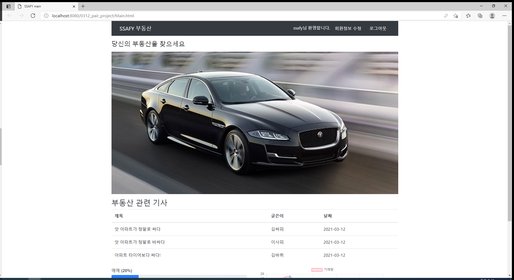

# 김경원-이종현 페어 프로젝트 

## 구현 내용 ##

-  기본 화면
-  우측 상단에 로그인, 회원가입, 비밀번호 찾기 버튼이 존재
　  
　  
　  
　  

　  
　  

-  가운데 사진에 마우스를 올리면 검색 버튼이 등장 ( 멋있습니다 hov 사용)
 　  
　  

　  
　  
 - 로그인 버튼을 누를 시 나오는 화면

　  
　  　  
　  
 - 로그인 성공 시 알림

　  
　  
- 로그인시 화면
- 우측 상단에 id명 + 환영합니다.
- 회원 정보를 수정할 수 있는 버튼 - 누르면 모달로 연결됨
- 로그 아웃 버튼 존재
　  
　  　  
　  

　  
　  
- 회원 정보 수정 및 삭제
- 바꾸고자하는 회원 정보를 입력
- 아이디는 고유 값이므로 disabled로 처리
- 수정하기를 누르면 '수정하였습니다. '라는 alert message

　  
　  

　  
　  
- 탈퇴하기를 누르면 '탈퇴되었습니다. '라는 alert message 후 로그인 화면으로 변환

　  
　  

　  
　  
- 부동산 관련 기사를 표로 제시함
- ***부동산 거래 관련하여서 매매, 전세, 월세, 반전세의 비율을 나타냄***
- ***부동산의 상반기 거래량을 월별 차트로 보여줌 (chart.js 활용 - 대단합니다)***

　  
　  

　  
　  
　  
 - 검색 결과 화면
 - 구글 map api를 이용하여 지도를 나타냄
 - 사용자의 검색 위치 중심으로 주변에 있는 아파트 정보에 핀이 찍힘 (현재는 DB가 없어서 임의로 위치 지정)
 - 좌측 사이드바에 매매 정보가 나타남
 - select box를 이용하여 검색 세부 설정을 할 수 있음 (시, 구, 동 단위)
  
 

열심히 했습니다 ! 